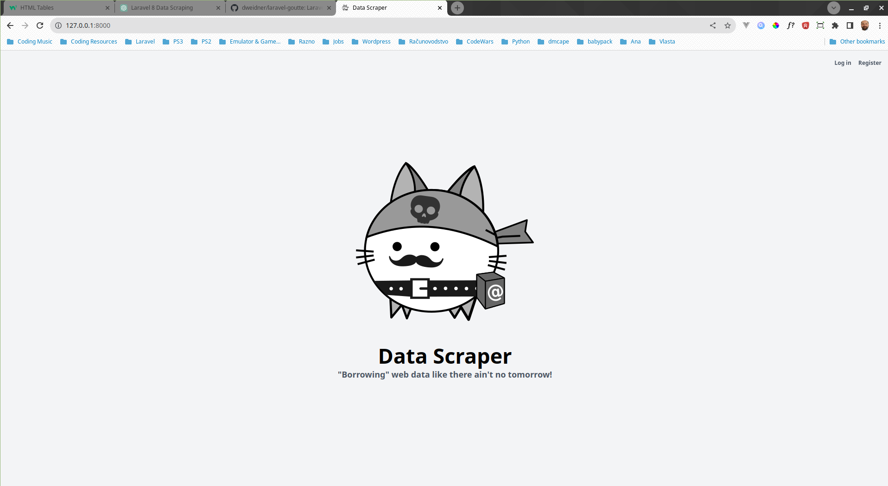

## Data Scraper App

#### Data Scraper application that provides following features:
+ Retrieve table data from specific page
+ Save data to company database

Data Scraper App Youtube Page - [Visit Website](https://www.youtube.com/@damirbubanovic6608)

## Built With

* [Tailwind CSS - 3.3.2](https://tailwindcss.com/) - Css Library used
* [Laravel - 10](https://laravel.com/) - Backend web framework used
* [Laravel-Goutte Data Scraper](https://github.com/dweidner/laravel-goutte) - Data Scraper Package Used
* [SQLite - 3.42.0](https://www.sqlite.org/index.html) - SQL database used

## Author

* **Damir Bubanović** - *Initial work* - [Github](https://github.com/damir-bubanovic)

## Creator Self Promo Links

Damir Bubanović

- **[DamirBubanovic.com](https://damirbubanovic.com/)**
- **[GitHub](https://github.com/damir-bubanovic)**
- **[StackOwerflow](https://stackoverflow.com/users/11778242/damir-bubanovic)**
- **[Yahoo](damir.bubanovic@yahoo.com)**

## Acknowledgments

* Hat tip to anyone whose code was used including ChatGPT
* Inspiration
* etc